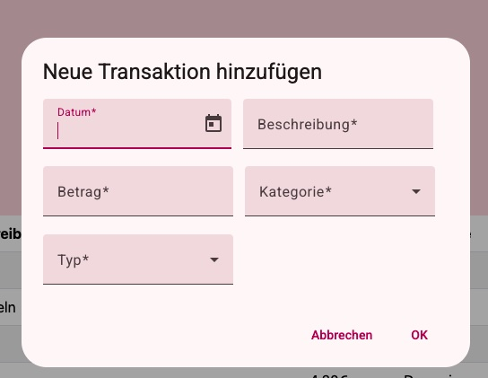

# Finanzverwaltung mit EasyFinance

## Übersicht zur Webanwendung:
1. Allgemeine Infos:
2. Beschreibung der Anwendung mit Screenshots
3. Datenmodell mit ER Diagramm und Konzept
4. Technologien
5. Anleitung zur Installation
6. Lizenz
7. Kontakt

## 1. Allgemeine Infos:
EasyFinance ist eine Webanwendung,
die im Kurs Webtechnologien 2024/25
unter der Leitung von Prof. Freiheit
von Maryam Mirza entwickelt wurde.
Das Backend wurde mit Render deployed und ist unter https://backendwebtech.onrender.com
erreichbar. Das Frontend ist mit Vercel deployed und
die Anwendung ist unter https://frontend-webtech.vercel.app erreichbar.

Die Webanwendung wurde mit Angular, Node.js und PostgreSQL gebaut.

## 2. Beschreibung der Anwendung mit Screenshots:

EasyFinanz ist an diejenigen gerichtet die einen Überblick über ihre Finanzen erhalten wollten.
Die Idee ist einfach Ausgaben und Einnahmen eintragen zu können und mit Wichtigkeitslabels unnötige Ausgaben direkt zu entdecken.
Alle Transaktionen werden in einer Datenbank verwaltet.
Praktisch ist, dass hier auch Bar Einnahmen und Ausgaben erfasst werden können, was
bei einem herkömmlichen Kontoauszug nicht erfasst wird.

### 2.1 Feature 1: Transaktion hinzufuegen
Um eine Transaktion hinzuzufügen klicke auf Transaktion hinzufügen.
Es öffnet sich ein Dialog und du kannst alle benötigten
Werte eingeben. Für die Transaktion gibt es ein Datepicker sodass du schnell das passende Datum findest.
Zudem gibt es Kategorien unter denen du per Drop Down auswählen kannst.
In dem Drop Down Typ gibst du ein, ob es sich um eine Eingabe oder Ausgabe handelt.
Ob es eine wichtige Ausgabe war, wird automatisch dann per Icon angezeigt, sobald du fertig bist.
Du kannst die Transaktion auch abbrechen, falls du es dir anders überlegst.



### 2.2 Feature 2: Transaktion löschen
Um eine Transaktion zu löschen klicke auf das Mülltonnen-Icon.
Es öffnet sich ein Dialog, sodass du die Transaktion löschen kannst.


### 2.6 Extra Feature:
Per Hinweis mit Ausrufezeichen-Icon lassen sich unnötige Ausgaben so schnell entdecken.
Damit erhält die Nutzer:in leicht einen Überblick, wo sie einfach einsparen könnte.

## 3. Datenmodell mit ER Diagramm und Konzept

HIER ER DIAGRAMM EINFUEGEN

Konzept: 

Die Webanwendung ist ein Prototyp zur Finanzverwaltung.
Die eingegebenen Daten sind fiktiv und dienen nur zum Ausprobieren.
Sie können von allen, die Zugriff auf die Seite haben verändert werden.

EasyFinance kann mit einer Registrierung und einem Login erweitert werden.
Damit auch echte persönliche Daten eingegeben werden können, ist ein Login
sowie eine Verschlüsselung der Datenbank zum Datenschutz notwendig.

Die Erweiterung könnte zudem noch eine weitere Bearbeiten-CRUD Operation
sowie Filter für eine detaillierte Analyse beinhalten.


## 4. Technologien:

- Entwicklungsumgebung: IntelliJ IDEA 2024.2.4 (Ultimate Edition)
- Datenbank: PostgreSQL Version 16
- Backend: Node.js v22.11.0, Express 4.21.2
- Frontend: Angular [Angular CLI](https://github.com/angular/angular-cli) version 19.2.0.
- HTML, CSS, Typescript

- Server für Backend und Datenbank: [Render](https://render.com/)
- Server für Frontend: [Vercel](https://vercel.com)


## 🛠️ 5. Anleitung zur Installation:

## Wichtiger Hinweis
Die Datenabank wurde mit Render deployed und ist bis zum 06.04.2025 erreichbar. 
Danach wird sie von Server genommen. 
Es kann dann stattdessen die Datenbank von ocean der HTW verwendet werden.
Dazu muss im Backend die .env Datei angepasst werden mit den Umgebungsvariablen und Anmeldeinformation der ocean Datenbank.

Das Backend ist unter https://backendwebtech.onrender.com erreichbar.

Die Frontend-Anwendung ist unter https://frontend-webtech.vercel.app erreichbar.

## Voraussetzungen:
[Node.js](https://nodejs.org/en) installiert haben.
[npm](https://docs.npmjs.com/downloading-and-installing-node-js-and-npm) installiert haben.

## Repository klonen (Frontend und Backend)

```bash
git clone https://gitlab.rz.htw-berlin.de/s0591690/webtechnologien_frontend.git
```
```bash
git clone https://gitlab.rz.htw-berlin.de/s0591690/webtechnologien_backend.git
```

In das entsprechende Projektverzeichnis mit der Bash wechseln:
Beispielweise:
```bash
cd webtechnologien_frontend
```
```bash
cd webtechnologien_backend
```

## Abhängigkeiten installieren
(Frontend und Backend)
```bash
npm install
```

### VPN verbinden

### Backend starten mit
```bash
node server.js
```

### Frontend starten mit
```bash
ng serve
```
Sobald der Server läuft, öffne deinen Browser und gehe zu `http://localhost:4200/`. 
Die Applikation wird automatisch neu laden wenn du die source files veränderst.

Wenn du das Projekt nicht lokal starten, 
sondern direkt über den Browser aufrufen möchtest, 
dann gehe zu https://frontend-webtech.vercel.app.

## Bauen
Um das Projekt zu deployen muss es vorher gebuildet werden. Das geht im Terminal mit:
```bash
ng build
```
Das kompiliert das Projekt und speichert die Build-Dateien im Verzeichnis `dist/`. 
Im dist Verzeichnis ist die fertige Version von der Webanwendung drin.


## 📝 6. Lizenz
Dieses Projekt steht unter der MIT-Lizenz. Weitere Informationen findest du in der LICENSE-Datei.

## 📞 7. Kontakt
Falls du Fragen hast, kontaktier mich unter:
Maryam.Mirza@Student.HTW-Berlin.de
